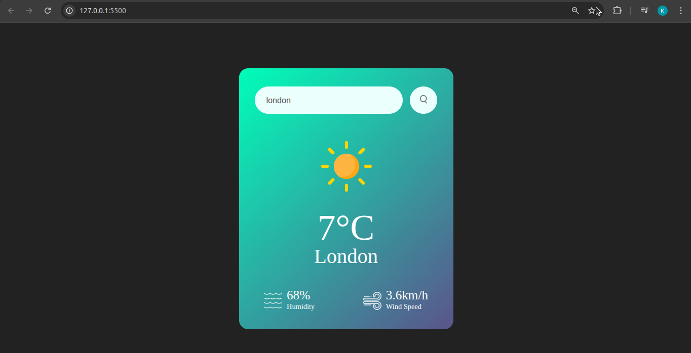

# 🌦️ Weather App

A simple and responsive Weather Application that allows users to check real-time weather information of any city. This project fetches live weather data from an API and displays details like temperature, humidity, and weather conditions in a clean UI.

---

## 🚀 Features

- 🌍 Search weather by city name  
- 🌡️ Displays current temperature  
- 💧 Shows humidity and weather conditions  
- 🌤️ Dynamic weather icons  
- 📱 Responsive design for all devices  

---

## 🛠️ Tech Stack

- HTML  
- CSS  
- JavaScript  
- Weather API  

---

## 📸 Screenshots

<!-- Add your project screenshots here -->

---

## ⚙️ How It Works

This app takes the city name as input and sends a request to a weather API. The API returns weather data in JSON format, which is then displayed on the UI.

---

## 📂 Installation & Setup

1. Clone the repository  
   git clone https://github.com/your-username/weather-app.git  

2. Navigate to the project folder  
   cd weather-app  

3. Open `index.html` in your browser  

---

## 🔮 Future Improvements

- Add 5-day weather forecast  
- Add location-based weather (GPS)  
- Improve UI/UX with animations  
- Integrate AI for weather insights  

---

## 🙌 Acknowledgement

This project was built by following a YouTube tutorial:  
https://youtu.be/MIYQR-Ybrn4  

---

## ⭐ Support

If you like this project, give it a ⭐ on GitHub!